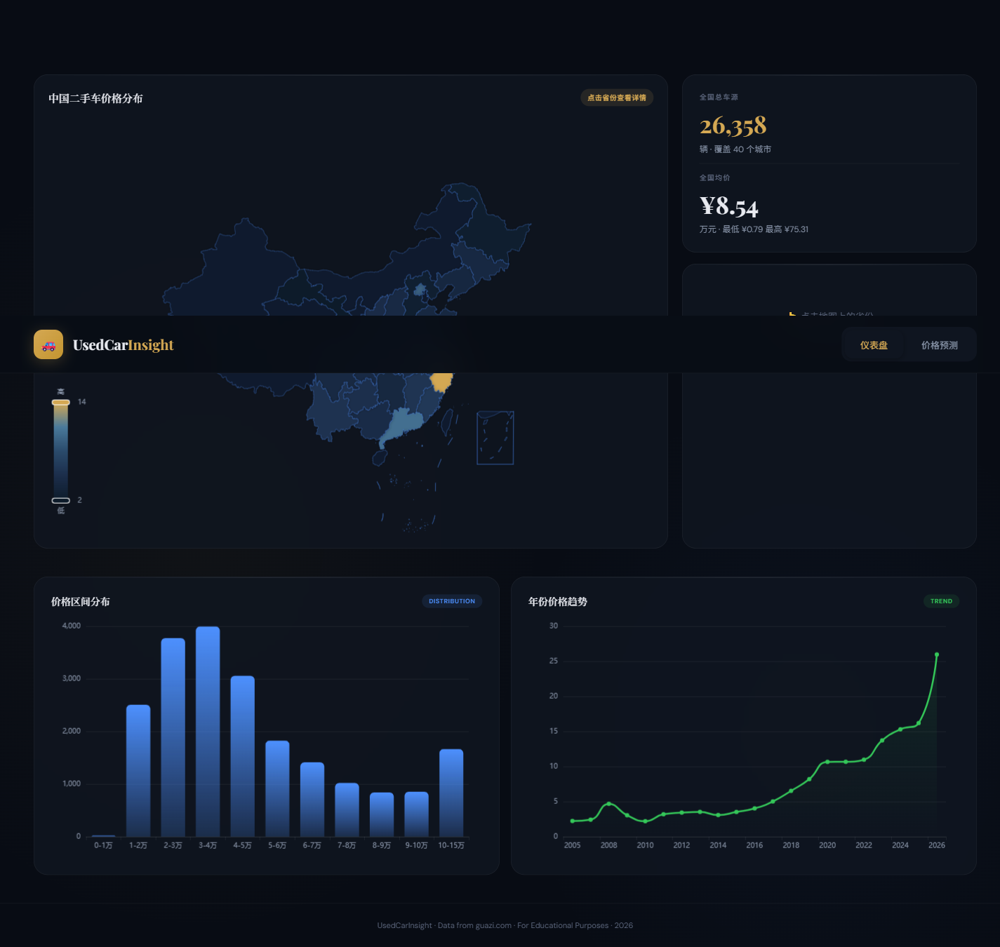
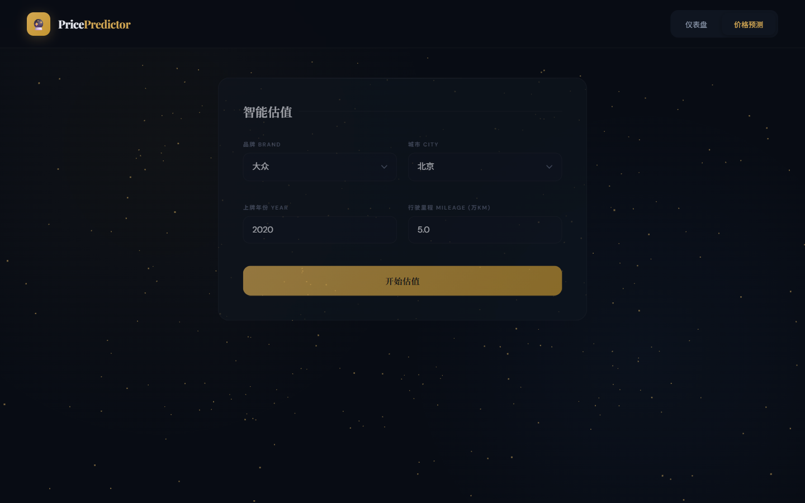

# 🚗 UsedCarInsight — 二手车价格分析与预测平台

> 二手车数据可视化分析 + 机器学习价格预测平台

[](https://github.com/TheShycute/car-price-predictor)

---

## 📸 预览

### 数据仪表盘


### 价格预测


---

## ✨ 功能

- 📦 **公开数据集** — 全国 40 城市、26,000+ 条真实二手车交易记录
- 🗺️ **中国地图可视化** — ECharts 中国地图，点击省份查看该省详细分析
- 📊 **交互式仪表盘** — 深色豪华主题，价格分布 / 品牌对比 / 年份趋势 / 城市排名 / 里程折旧
- 🔮 **ML 价格预测** — XGBoost 模型，R² = 0.76，输入品牌/城市/年份/里程即时估价
- 🎨 **3D 粒子背景** — Three.js 动态粒子效果
- 📡 **RESTful API** — Flask 后端，数据查询 + 预测接口

---

## 📊 数据概览

| 指标 | 数值 |
|------|------|
| 总车源 | **26,358** 条 |
| 覆盖城市 | 40 个 |
| 价格范围 | ¥0.79 ~ ¥75.31 万 |
| 品牌数 | 242 个 |
| 年份范围 | 2005 ~ 2026 |

### 头部城市

| 城市 | 车源数 |
|------|--------|
| 广州 | 4,182 |
| 上海 | 4,011 |
| 杭州 | 3,598 |
| 北京 | 2,469 |
| 南宁 | 2,373 |
| 成都 | 2,032 |
| 深圳 | 1,637 |
| 昆明 | 1,425 |

---

## 🧠 预测模型

- **算法**: XGBoost Regressor
- **特征**: 年份、里程、车龄、品牌、城市
- **性能**: R² = 0.76, MAE ≈ 2.35 万
- **训练数据**: 26,358 条真实交易记录

---

## 📁 项目结构

```
car-price-predictor/
├── scraper/                  # 数据采集脚本
│   └── full_scraper.py       # 数据采集脚本
│   └── ...
├── app/                      # Web 应用
│   ├── app.py                # Flask 后端 + API
│   ├── data_processor.py     # 数据清洗
│   └── templates/
│       ├── index.html        # 仪表盘 (中国地图 + 图表)
│       └── predict.html      # 价格预测页
├── model/                    # 机器学习
│   ├── train_model.py        # XGBoost 训练
│   └── price_model.pkl       # 训练好的模型
├── data/
│   ├── cars_raw.csv          # 原始数据
│   └── cars_cleaned.csv      # 清洗后数据
├── screenshots/              # 截图
├── requirements.txt
└── README.md
```

---

## 🔧 安装与运行

### 1. 克隆项目
```bash
git clone https://github.com/TheShycute/car-price-predictor.git
cd car-price-predictor
```

### 2. 安装依赖
```bash
pip install -r requirements.txt
playwright install chromium
```

### 3. 爬取数据（可选，仓库中已有示例数据）
> 如需完整数据集用于个人学习研究，请联系作者获取。

### 4. 训练模型
```bash
python model/train_model.py
```

### 5. 启动 Web 服务
```bash
python app/app.py
# 访问 http://localhost:5000
```

---

## 🛠️ 技术栈

| 层 | 技术 |
|----|------|
| 数据采集 | 公开数据集 |
| 后端 | Flask + pandas |
| 前端 | ECharts + Three.js + GSAP |
| 机器学习 | XGBoost + scikit-learn |
| 样式 | Playfair Display + DM Sans + Dark Theme |

---

## ⚠️ 声明

本项目仅供学习研究使用。数据来源于公开的二手车平台。请遵守相关网站的使用条款，合理控制爬取频率。

---

## 📝 License

MIT License

